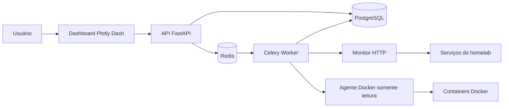

# Arquitetura planejada

## Responsabilidades

- **FastAPI:** autenticação, regras de acesso, cadastro e consulta de recursos.
- **PostgreSQL:** usuários, servidores, serviços, métricas e incidentes.
- **Redis/Celery:** fila e execução periódica das verificações.
- **Monitor HTTP:** disponibilidade, latência e código de resposta.
- **Agente Docker:** coleta somente leitura do estado e do consumo dos containers.
- **Plotly Dash:** visualização dos indicadores obtidos pela API.

## Isolamento dos dados

Cada servidor possui um proprietário e cada serviço pertence a um servidor. Todas as consultas autenticadas aplicam o identificador do usuário. Assim, uma conta não consegue listar, consultar, alterar ou excluir recursos de outra. A API retorna `404` nesses casos para não confirmar a existência do recurso.

## Autenticação e autorização

As senhas são armazenadas somente como hashes Argon2. Após o login, a API emite um JWT com validade configurável. Rotas privadas validam o token e carregam o usuário diretamente do banco. O cadastro público sempre cria contas comuns; ações administrativas exigem o perfil `admin`, criado por um comando executado no servidor.

## Segurança do Docker

O socket Docker não será exposto diretamente à aplicação web. A coleta usará um agente restrito ou um proxy de socket com apenas as operações de leitura necessárias. Tokens de integrações serão recebidos por variáveis de ambiente e nunca versionados.
